# THE PRODUCTION — GALLERY · P0 baseline · as shipped 2026-09-02 (HEAD 2c437c5, before THE PRODUCTION built anything)

> HEAD `2c437c5` · run 2026-09-02T07:23:16.121Z · 79 routes × 2 themes, captured as shipped and with every GL layer forced off
> (`window.__LCX_GL_OFF` → `createStage` refuses `FORCED_OFF_FOR_MEASUREMENT`; relief preferences seeded off).
> **GL coverage** = share of viewport pixels that differ between the two captures (any channel > 8/255). This is the
> number that says whether the 3D is VISIBLE on a route. The controls: a known 40% GL area reads 40% ± 1; identical
> captures read 0.

| | dark | light |
|---|---|---|
| routes where GL is visible (coverage > 5%) | **3** of 79 | **4** of 79 |
| median GL coverage of the viewport | **0%** | **0%** |

### dark

| route | as shipped | GL forced off | GL coverage | mean ΔE76 |
|---|---|---|---|---|
| `/lcxos` |  |  | **0%** | 0.0 |
| `/portal` |  |  | **0%** | 0.0 |
| `/select` |  |  | **95%** | 25.5 |
| `/regulatory-dashboard` |  | 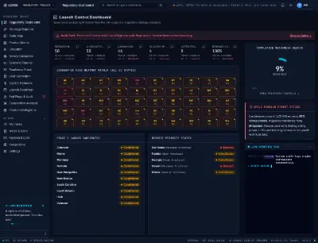 | **0%** | 26.4 |
| `/ontology` | 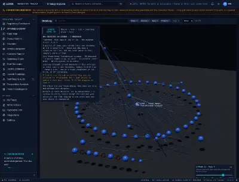 | 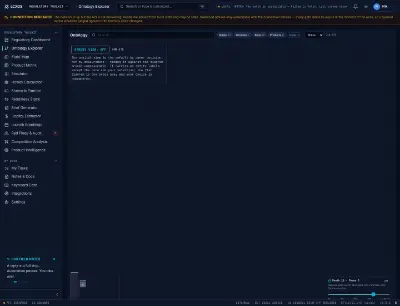 | **58%** | 13.8 |
| `/states` | 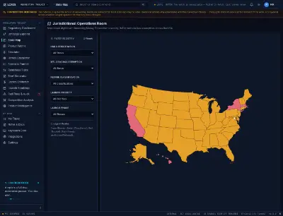 |  | **0%** | 28.1 |
| `/products` | 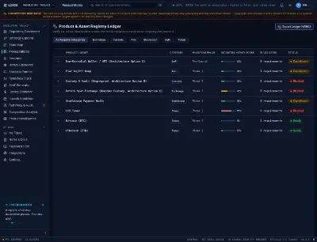 |  | **0%** | 24.7 |
| `/simulator` | 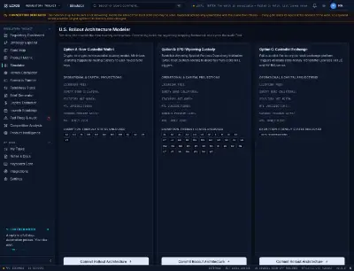 |  | **0%** | 27.0 |
| `/howey` | 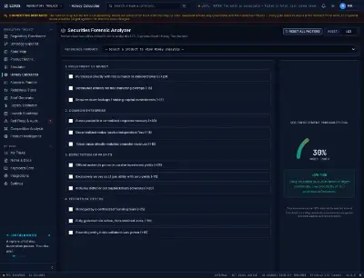 | 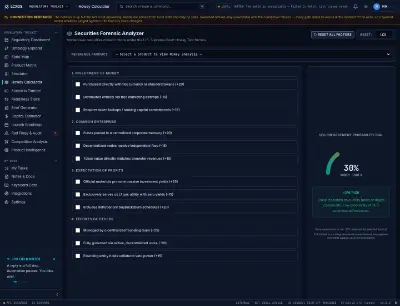 | **0%** | 19.9 |
| `/scenario` |  | 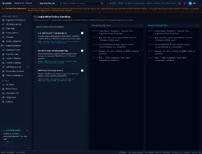 | **0%** | 24.2 |
| `/readiness` |  | 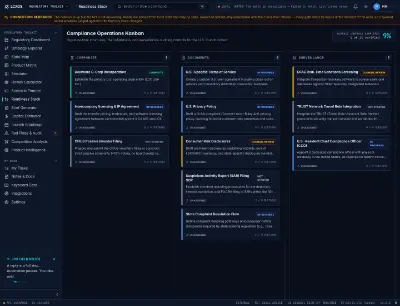 | **0%** | 27.1 |
| `/brief-generator` | 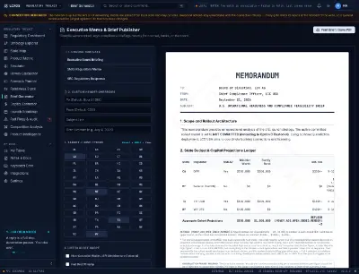 |  | **0%** | 23.5 |
| `/capital-estimator` | 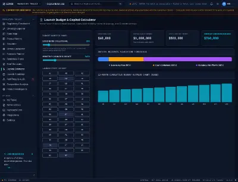 | 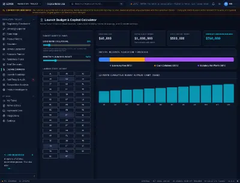 | **0%** | 25.7 |
| `/roadmap` |  | 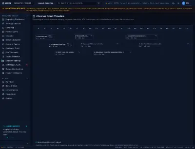 | **0%** | 28.4 |
| `/red-flags` | 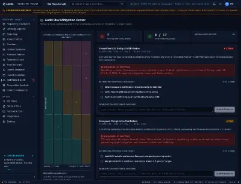 |  | **0%** | 23.1 |
| `/settings` |  | 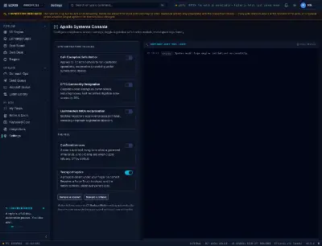 | **0%** | 25.1 |
| `/competition` |  | 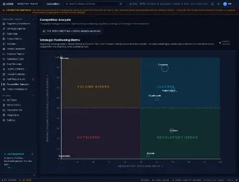 | **0%** | 51.9 |
| `/product-intel` | 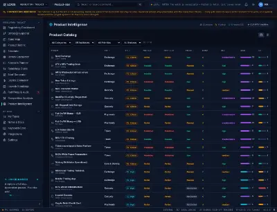 | 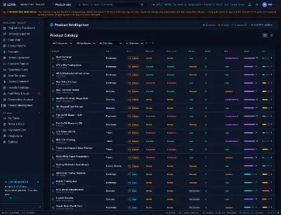 | **0%** | 24.8 |
| `/bd-pipeline` | 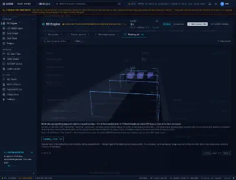 | 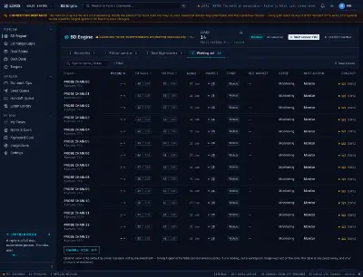 | **16%** | 18.2 |
| `/bd-pipeline/:id` | 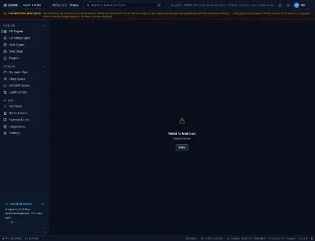 |  | **0%** | 24.8 |
| `/contacts/:id` |  | 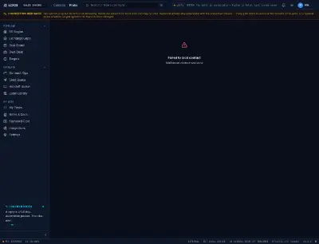 | **0%** | 25.7 |
| `/claim-library` |  | 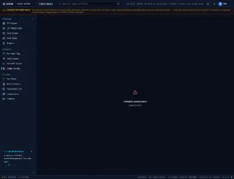 | **0%** | 24.6 |
| `/outreach` |  | 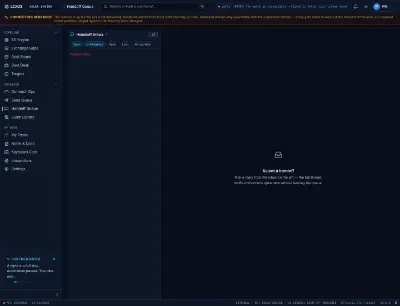 | **0%** | 26.1 |
| `/send-queue` |  | 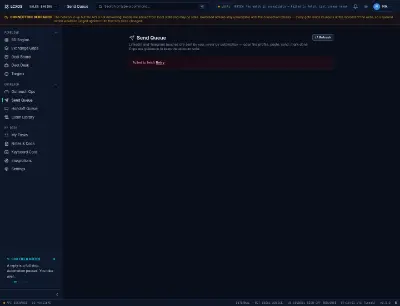 | **0%** | 53.7 |
| `/exchange-gaps` | 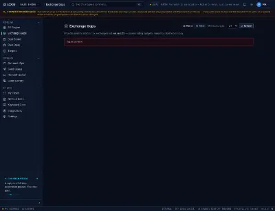 | 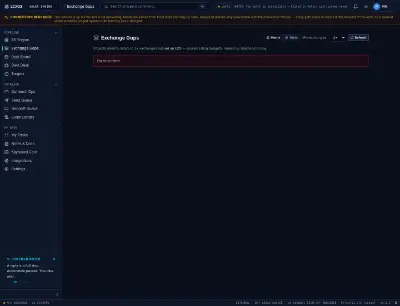 | **0%** | 21.7 |
| `/deal-board` | 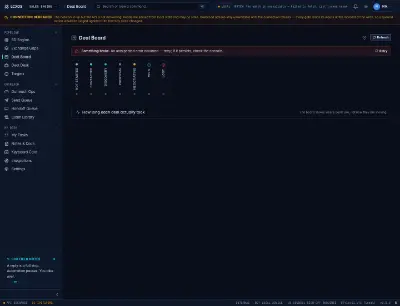 | 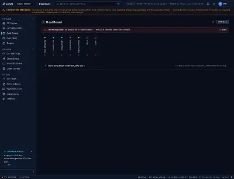 | **0%** | 53.1 |
| `/tasks` |  | 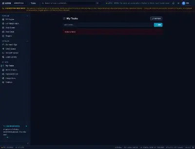 | **0%** | 28.1 |
| `/market-map` |  | 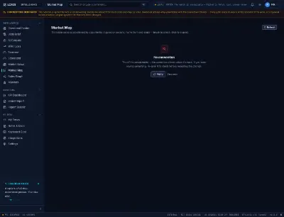 | **0%** | 22.2 |
| `/graph` | 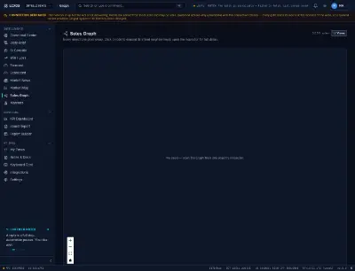 |  | **0%** | 20.2 |
| `/monitors` |  | 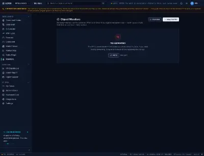 | **0%** | 18.6 |
| `/targets` | 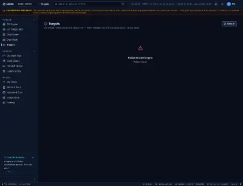 | 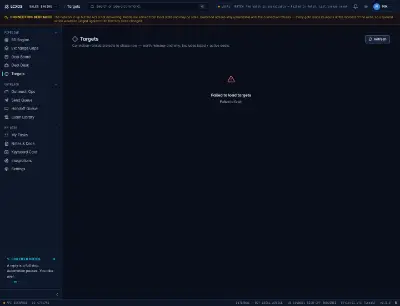 | **0%** | 27.6 |
| `/brief` | 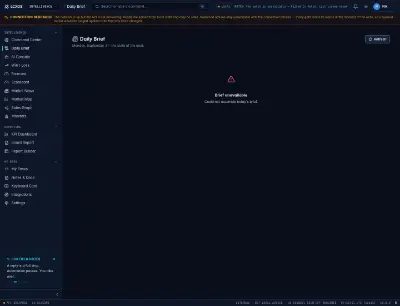 |  | **0%** | 22.9 |
| `/forecast` |  |  | **0%** | 25.3 |
| `/command` | 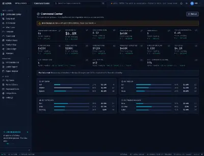 |  | **0%** | 25.9 |
| `/scorecard` |  | 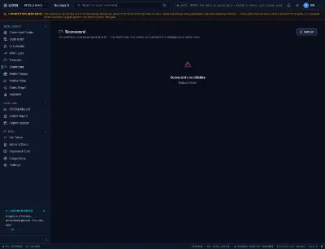 | **0%** | 22.6 |
| `/coverage/:id` |  |  | **0%** | 17.0 |
| `/customer/:id` |  |  | **0%** | 23.9 |
| `/notes` | 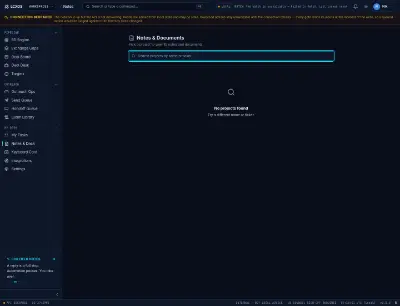 |  | **0%** | 24.8 |
| `/notes/:projectId` |  | 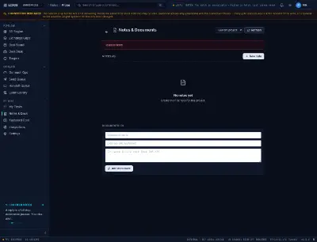 | **0%** | 21.2 |
| `/win-loss` | 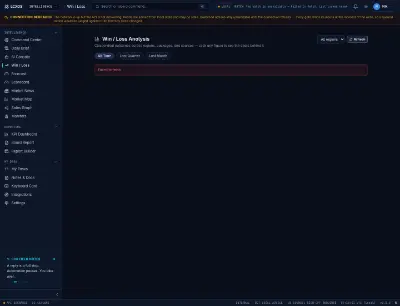 | 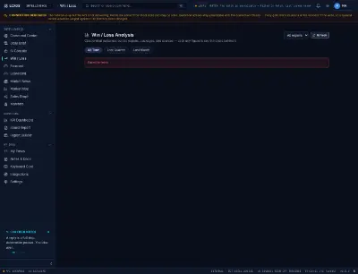 | **0%** | 23.6 |
| `/ai-tools` |  | 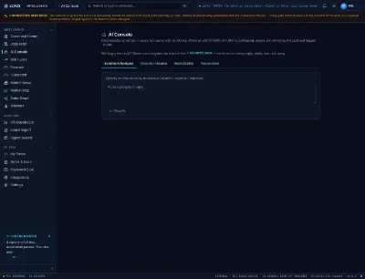 | **0%** | 51.6 |
| `/outreach-ops` | 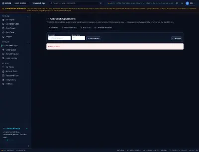 | 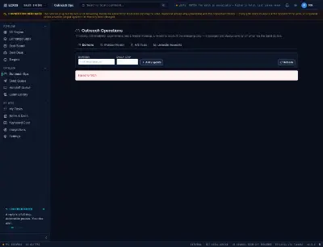 | **0%** | 25.0 |
| `/deal-desk` | 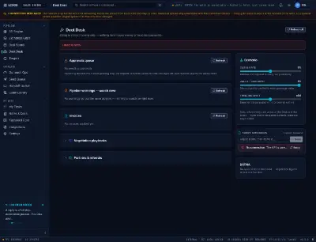 |  | **0%** | 23.4 |
| `/integrations` |  | 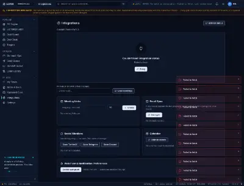 | **0%** | 24.9 |
| `/board-report` |  | 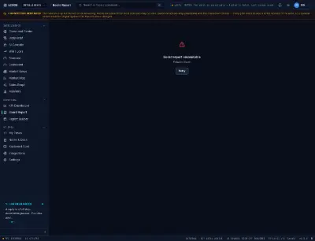 | **0%** | 24.9 |
| `/market-news` |  |  | **0%** | 29.7 |
| `/report-builder` |  | 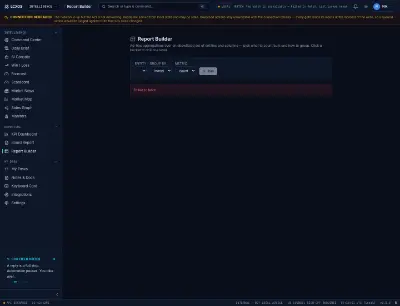 | **0%** | 23.0 |
| `/bd-kpis` |  |  | **0%** | 20.1 |
| `/audit-log` |  |  | **0%** | 26.1 |
| `/ops` |  |  | **0%** | 0.0 |
| `/wbr` |  |  | **0%** | 21.5 |
| `/readout` |  |  | **0%** | 24.6 |
| `/access` |  |  | **0%** | 25.8 |
| `/distribution` |  |  | **0%** | 25.9 |
| `/distribution/atlas` |  |  | **0%** | 24.6 |
| `/distribution/listings` |  |  | **0%** | 26.2 |
| `/distribution/campaigns` |  |  | **0%** | 24.6 |
| `/distribution/geo` |  |  | **0%** | 26.3 |
| `/marketing` |  |  | **0%** | 24.4 |
| `/marketing/desk` |  |  | **0%** | 19.4 |
| `/marketing/record` |  |  | **0%** | 24.2 |
| `/marketing/crisis` |  |  | **0%** | 23.3 |
| `/marketing/holdings` |  |  | **0%** | 23.8 |
| `/gps` |  |  | **0%** | 26.4 |
| `/gps/book` |  |  | **0%** | 26.9 |
| `/gps/underwriting` |  |  | **0%** | 24.6 |
| `/gps/origination` |  |  | **0%** | 24.3 |
| `/gps/conflict` |  |  | **0%** | 24.8 |
| `/gps/delivery` |  |  | **0%** | 23.6 |
| `/gps/loop` |  |  | **0%** | 28.2 |
| `/gps/inputs` |  |  | **0%** | 22.2 |
| `/gps/partner-registry` |  |  | **0%** | 20.2 |
| `/governance/controls` |  |  | **0%** | 20.5 |
| `/decisions` |  |  | **0%** | 23.9 |
| `/command-deck` |  |  | **0%** | 25.1 |
| `/command-partners` |  |  | **0%** | 27.6 |
| `/command-ops` |  |  | **0%** | 51.8 |
| `/cheat-card` |  |  | **0%** | 25.4 |
| `/practice` |  |  | **0%** | 25.5 |

### light

| route | as shipped | GL forced off | GL coverage | mean ΔE76 |
|---|---|---|---|---|
| `/lcxos` |  |  | **0%** | 0.0 |
| `/portal` |  |  | **0%** | 0.0 |
| `/select` |  |  | **96%** | 22.7 |
| `/regulatory-dashboard` |  |  | **32%** | 23.8 |
| `/ontology` |  |  | **39%** | 9.6 |
| `/states` |  |  | **0%** | 24.7 |
| `/products` |  |  | **0%** | 23.8 |
| `/simulator` |  |  | **0%** | 24.7 |
| `/howey` |  |  | **0%** | 26.4 |
| `/scenario` |  |  | **0%** | 21.2 |
| `/readiness` |  |  | **0%** | 23.6 |
| `/brief-generator` |  |  | **0%** | 21.3 |
| `/capital-estimator` |  |  | **0%** | 18.0 |
| `/roadmap` |  |  | **0%** | 22.6 |
| `/red-flags` |  |  | **0%** | 23.9 |
| `/settings` |  |  | **0%** | 26.1 |
| `/competition` |  |  | **0%** | 44.1 |
| `/product-intel` |  |  | **0%** | 22.9 |
| `/bd-pipeline` |  |  | **33%** | 13.7 |
| `/bd-pipeline/:id` |  |  | **0%** | 43.8 |
| `/contacts/:id` |  |  | **0%** | 24.5 |
| `/claim-library` |  |  | **0%** | 22.7 |
| `/outreach` |  |  | **0%** | 46.3 |
| `/send-queue` |  |  | **0%** | 23.0 |
| `/exchange-gaps` |  |  | **0%** | 23.6 |
| `/deal-board` |  |  | **0%** | 23.6 |
| `/tasks` |  |  | **0%** | 26.2 |
| `/market-map` |  |  | **0%** | 26.2 |
| `/graph` |  |  | **0%** | 22.7 |
| `/monitors` |  |  | **0%** | 22.2 |
| `/targets` |  |  | **0%** | 22.7 |
| `/brief` |  |  | **0%** | 23.1 |
| `/forecast` |  |  | **0%** | 22.5 |
| `/command` |  |  | **0%** | 23.3 |
| `/scorecard` |  |  | **0%** | 18.9 |
| `/coverage/:id` |  |  | **0%** | 18.2 |
| `/customer/:id` |  |  | **0%** | 27.4 |
| `/notes` |  |  | **0%** | 23.8 |
| `/notes/:projectId` |  |  | **0%** | 25.5 |
| `/win-loss` |  |  | **0%** | 26.4 |
| `/ai-tools` |  |  | **0%** | 25.4 |
| `/outreach-ops` |  |  | **0%** | 18.2 |
| `/deal-desk` |  |  | **0%** | 18.2 |
| `/integrations` |  |  | **0%** | 21.5 |
| `/board-report` |  |  | **0%** | 24.8 |
| `/market-news` |  |  | **0%** | 23.1 |
| `/report-builder` |  |  | **0%** | 0.0 |
| `/bd-kpis` |  |  | **0%** | 18.8 |
| `/audit-log` |  |  | **0%** | 27.0 |
| `/ops` |  |  | **0%** | 22.3 |
| `/wbr` |  |  | **0%** | 24.4 |
| `/readout` |  |  | **0%** | 21.0 |
| `/access` |  |  | **0%** | 20.0 |
| `/distribution` |  |  | **0%** | 25.2 |
| `/distribution/atlas` |  |  | **0%** | 22.9 |
| `/distribution/listings` |  |  | **0%** | 22.0 |
| `/distribution/campaigns` |  |  | **0%** | 24.8 |
| `/distribution/geo` |  |  | **0%** | 24.0 |
| `/marketing` |  |  | **0%** | 19.4 |
| `/marketing/desk` |  |  | **0%** | 27.1 |
| `/marketing/record` |  |  | **0%** | 23.9 |
| `/marketing/crisis` |  |  | **0%** | 21.1 |
| `/marketing/holdings` |  |  | **0%** | 20.8 |
| `/gps` |  |  | **0%** | 20.3 |
| `/gps/book` |  |  | **0%** | 20.8 |
| `/gps/underwriting` |  |  | **0%** | 24.0 |
| `/gps/origination` |  |  | **0%** | 24.0 |
| `/gps/conflict` |  |  | **0%** | 24.0 |
| `/gps/delivery` |  |  | **0%** | 22.8 |
| `/gps/loop` |  |  | **0%** | 20.3 |
| `/gps/inputs` |  |  | **0%** | 21.6 |
| `/gps/partner-registry` |  |  | **0%** | 24.4 |
| `/governance/controls` |  |  | **0%** | 23.4 |
| `/decisions` |  |  | **0%** | 24.8 |
| `/command-deck` |  |  | **0%** | 24.8 |
| `/command-partners` |  |  | **0%** | 24.6 |
| `/command-ops` |  |  | **0%** | 27.4 |
| `/cheat-card` |  |  | **0%** | 22.6 |
| `/practice` |  |  | **0%** | 24.6 |
