# THE PRODUCTION — GALLERY · P2 · the camera moves (2026-09-02)

> HEAD `08cfe3f` · run 2026-09-02T09:28:03.059Z · 79 routes × 2 themes, captured as shipped and with every GL layer forced off
> (`window.__LCX_GL_OFF` → `createStage` refuses `FORCED_OFF_FOR_MEASUREMENT`; relief preferences seeded off).
> **GL coverage** = share of viewport pixels that differ between the two captures (any channel > 8/255). This is the
> number that says whether the 3D is VISIBLE on a route. The controls: a known 40% GL area reads 40% ± 1; identical
> captures read 0.

| | dark | light |
|---|---|---|
| routes where GL is visible (coverage > 5%) | **77** of 79 | **77** of 79 |
| median GL coverage of the viewport | **55%** | **17%** |

### dark

| route | as shipped | GL forced off | GL coverage | mean ΔE76 |
|---|---|---|---|---|
| `/lcxos` |  |  | **0%** | 0.0 |
| `/portal` |  |  | **0%** | 0.0 |
| `/select` |  |  | **95%** | 25.5 |
| `/regulatory-dashboard` | 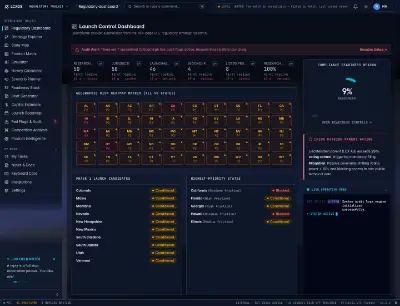 | 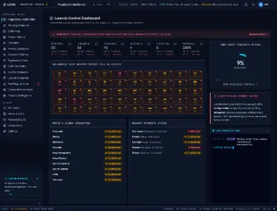 | **42%** | 23.6 |
| `/ontology` | 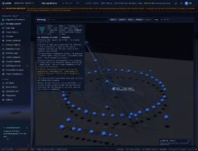 | 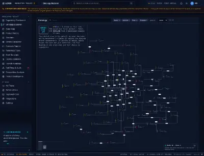 | **32%** | 12.8 |
| `/states` | 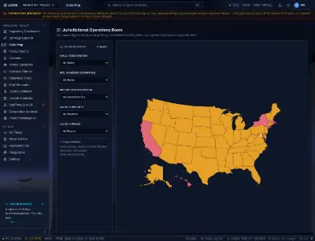 | 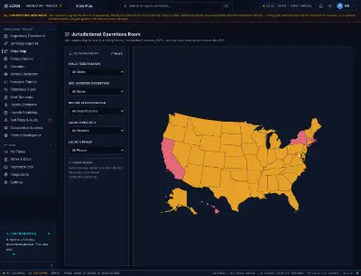 | **15%** | 18.3 |
| `/products` | 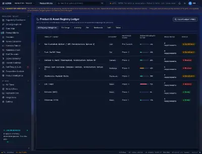 | 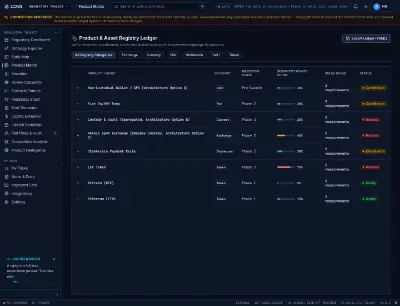 | **17%** | 18.3 |
| `/simulator` | 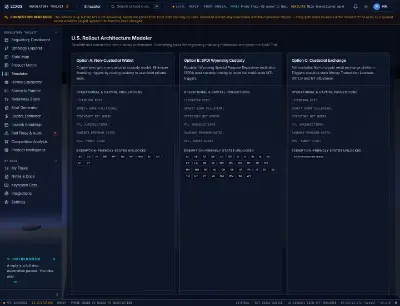 | 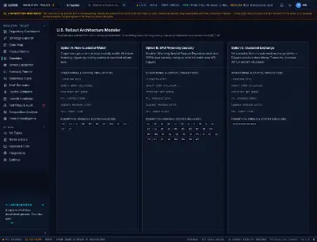 | **16%** | 17.7 |
| `/howey` | 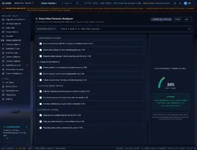 | 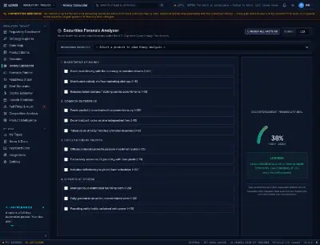 | **16%** | 18.1 |
| `/scenario` | 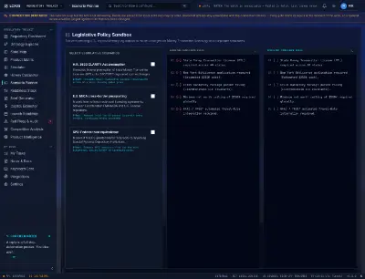 | 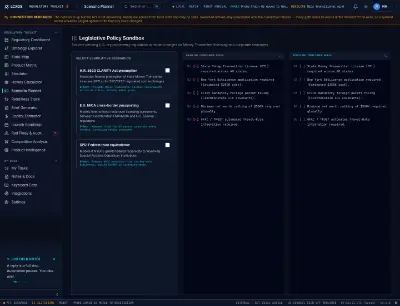 | **16%** | 17.9 |
| `/readiness` | 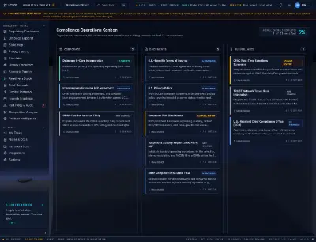 | 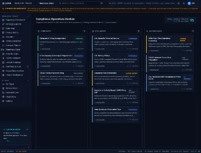 | **36%** | 13.0 |
| `/brief-generator` | 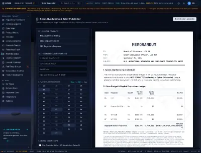 | 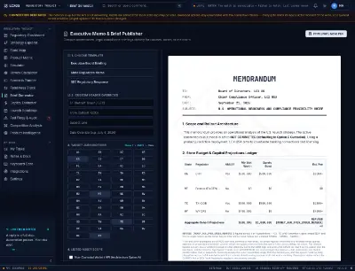 | **19%** | 16.8 |
| `/capital-estimator` | 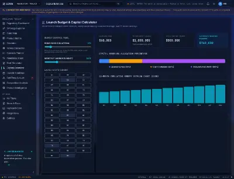 | 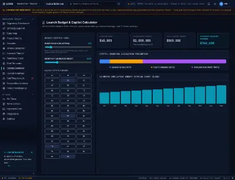 | **83%** | 12.6 |
| `/roadmap` | 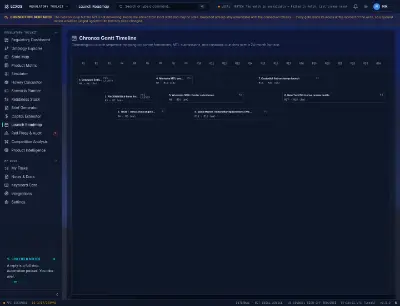 | 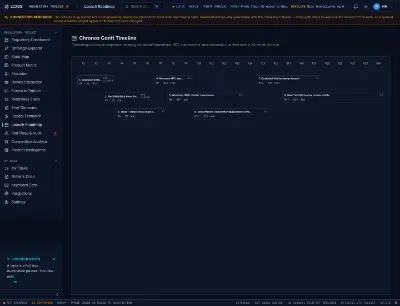 | **16%** | 18.5 |
| `/red-flags` | 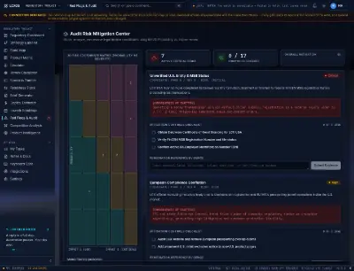 | 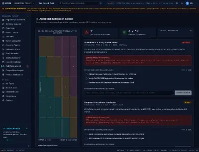 | **18%** | 17.6 |
| `/settings` | 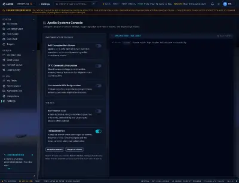 | 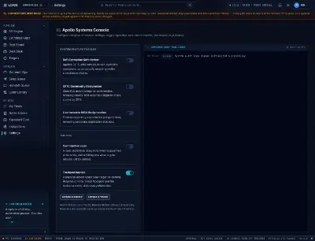 | **16%** | 18.1 |
| `/competition` | 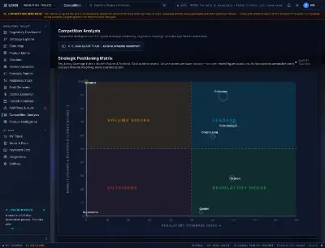 |  | **24%** | 16.9 |
| `/product-intel` | 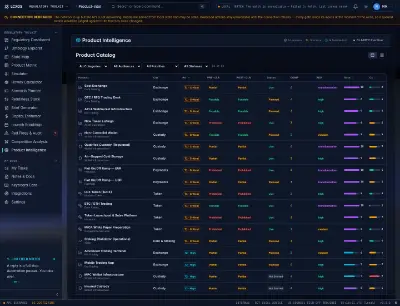 | 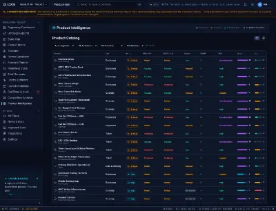 | **18%** | 17.6 |
| `/bd-pipeline` | 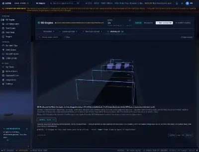 | 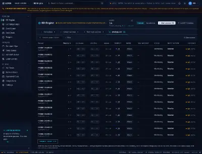 | **33%** | 16.6 |
| `/bd-pipeline/:id` |  | 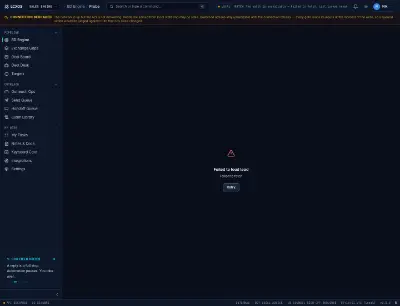 | **66%** | 11.4 |
| `/contacts/:id` |  | 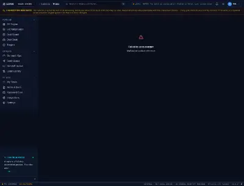 | **66%** | 11.4 |
| `/claim-library` | 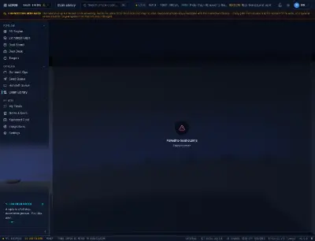 | 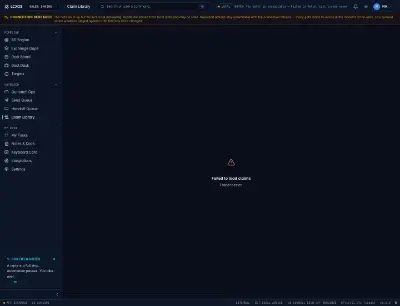 | **66%** | 11.4 |
| `/outreach` | 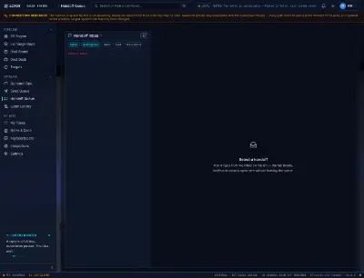 | 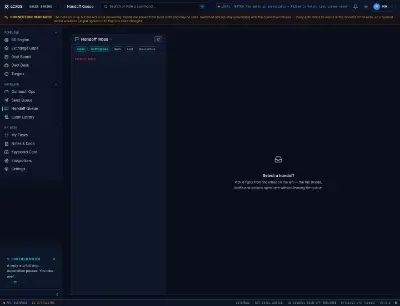 | **11%** | 18.6 |
| `/send-queue` |  | 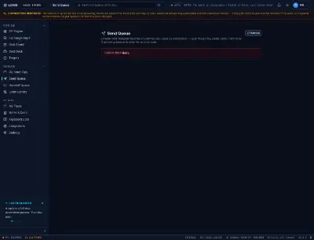 | **66%** | 11.2 |
| `/exchange-gaps` |  | 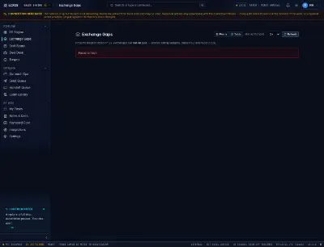 | **66%** | 11.2 |
| `/deal-board` | 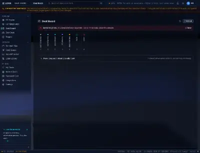 | 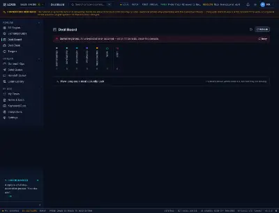 | **66%** | 11.2 |
| `/tasks` |  | 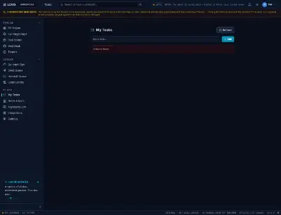 | **64%** | 11.4 |
| `/market-map` | 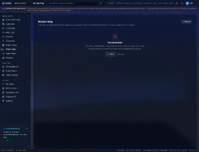 | 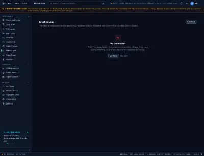 | **65%** | 11.6 |
| `/graph` |  | 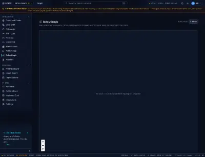 | **18%** | 17.5 |
| `/monitors` | 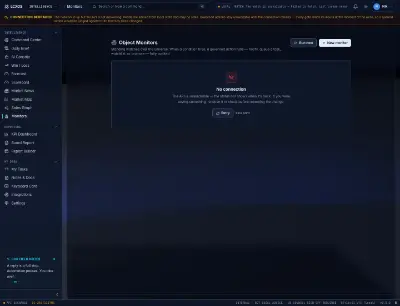 | 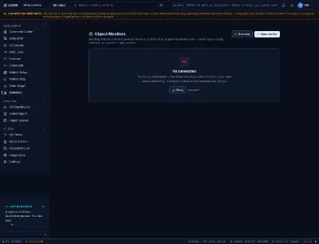 | **52%** | 11.8 |
| `/targets` | 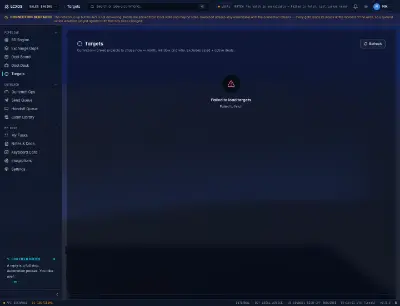 | 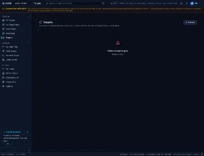 | **66%** | 11.4 |
| `/brief` |  | 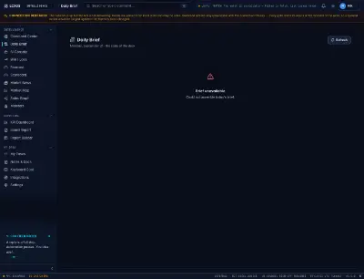 | **65%** | 11.6 |
| `/forecast` |  |  | **65%** | 11.6 |
| `/command` |  |  | **45%** | 11.5 |
| `/scorecard` |  |  | **65%** | 11.6 |
| `/coverage/:id` |  |  | **66%** | 11.4 |
| `/customer/:id` |  |  | **66%** | 11.4 |
| `/notes` |  |  | **63%** | 11.5 |
| `/notes/:projectId` |  |  | **55%** | 11.7 |
| `/win-loss` |  |  | **65%** | 11.4 |
| `/ai-tools` |  |  | **55%** | 12.1 |
| `/outreach-ops` |  |  | **59%** | 11.3 |
| `/deal-desk` |  |  | **34%** | 12.9 |
| `/integrations` |  |  | **29%** | 13.9 |
| `/board-report` |  |  | **65%** | 11.6 |
| `/market-news` |  |  | **52%** | 12.0 |
| `/report-builder` |  |  | **62%** | 11.3 |
| `/bd-kpis` |  |  | **66%** | 11.6 |
| `/audit-log` |  |  | **59%** | 11.3 |
| `/ops` |  |  | **65%** | 11.7 |
| `/wbr` |  |  | **26%** | 12.9 |
| `/readout` |  |  | **64%** | 10.9 |
| `/access` |  |  | **30%** | 13.4 |
| `/distribution` |  |  | **39%** | 11.8 |
| `/distribution/atlas` |  |  | **65%** | 11.7 |
| `/distribution/listings` |  |  | **65%** | 11.7 |
| `/distribution/campaigns` |  |  | **58%** | 11.5 |
| `/distribution/geo` |  |  | **65%** | 11.7 |
| `/marketing` |  |  | **51%** | 11.8 |
| `/marketing/desk` |  |  | **65%** | 11.7 |
| `/marketing/record` |  |  | **48%** | 12.4 |
| `/marketing/crisis` |  |  | **29%** | 13.5 |
| `/marketing/holdings` |  |  | **61%** | 11.5 |
| `/gps` |  |  | **34%** | 13.1 |
| `/gps/book` |  |  | **65%** | 11.7 |
| `/gps/underwriting` |  |  | **46%** | 12.2 |
| `/gps/origination` |  |  | **57%** | 11.3 |
| `/gps/conflict` |  |  | **45%** | 12.1 |
| `/gps/delivery` |  |  | **65%** | 11.8 |
| `/gps/loop` |  |  | **65%** | 11.7 |
| `/gps/inputs` |  |  | **53%** | 11.6 |
| `/gps/partner-registry` |  |  | **65%** | 11.7 |
| `/governance/controls` |  |  | **41%** | 11.6 |
| `/decisions` |  |  | **65%** | 11.7 |
| `/command-deck` |  |  | **34%** | 11.8 |
| `/command-partners` |  |  | **65%** | 11.4 |
| `/command-ops` |  |  | **65%** | 11.4 |
| `/cheat-card` |  |  | **32%** | 13.8 |
| `/practice` |  |  | **24%** | 13.1 |

### light

| route | as shipped | GL forced off | GL coverage | mean ΔE76 |
|---|---|---|---|---|
| `/lcxos` |  |  | **0%** | 0.0 |
| `/portal` |  |  | **0%** | 0.0 |
| `/select` |  |  | **96%** | 22.7 |
| `/regulatory-dashboard` |  |  | **17%** | 5.3 |
| `/ontology` |  |  | **42%** | 7.7 |
| `/states` |  |  | **10%** | 6.6 |
| `/products` |  |  | **13%** | 5.9 |
| `/simulator` |  |  | **11%** | 6.4 |
| `/howey` |  |  | **11%** | 6.4 |
| `/scenario` |  |  | **10%** | 6.6 |
| `/readiness` |  |  | **11%** | 6.4 |
| `/brief-generator` |  |  | **11%** | 6.3 |
| `/capital-estimator` |  |  | **12%** | 6.0 |
| `/roadmap` |  |  | **11%** | 6.3 |
| `/red-flags` |  |  | **12%** | 6.0 |
| `/settings` |  |  | **11%** | 6.2 |
| `/competition` |  |  | **17%** | 5.2 |
| `/product-intel` |  |  | **12%** | 6.1 |
| `/bd-pipeline` |  |  | **41%** | 12.5 |
| `/bd-pipeline/:id` |  |  | **21%** | 4.8 |
| `/contacts/:id` |  |  | **21%** | 4.8 |
| `/claim-library` |  |  | **21%** | 4.8 |
| `/outreach` |  |  | **6%** | 9.0 |
| `/send-queue` |  |  | **19%** | 5.0 |
| `/exchange-gaps` |  |  | **18%** | 5.1 |
| `/deal-board` |  |  | **17%** | 5.2 |
| `/tasks` |  |  | **18%** | 5.2 |
| `/market-map` |  |  | **21%** | 4.9 |
| `/graph` |  |  | **12%** | 6.0 |
| `/monitors` |  |  | **16%** | 5.3 |
| `/targets` |  |  | **21%** | 4.9 |
| `/brief` |  |  | **21%** | 4.9 |
| `/forecast` |  |  | **21%** | 4.9 |
| `/command` |  |  | **21%** | 4.9 |
| `/scorecard` |  |  | **21%** | 4.9 |
| `/coverage/:id` |  |  | **21%** | 4.8 |
| `/customer/:id` |  |  | **21%** | 4.8 |
| `/notes` |  |  | **19%** | 5.0 |
| `/notes/:projectId` |  |  | **19%** | 5.1 |
| `/win-loss` |  |  | **18%** | 5.2 |
| `/ai-tools` |  |  | **20%** | 4.9 |
| `/outreach-ops` |  |  | **18%** | 5.1 |
| `/deal-desk` |  |  | **15%** | 5.5 |
| `/integrations` |  |  | **12%** | 6.0 |
| `/board-report` |  |  | **21%** | 4.8 |
| `/market-news` |  |  | **17%** | 5.3 |
| `/report-builder` |  |  | **17%** | 5.2 |
| `/bd-kpis` |  |  | **21%** | 4.8 |
| `/audit-log` |  |  | **15%** | 5.6 |
| `/ops` |  |  | **20%** | 4.9 |
| `/wbr` |  |  | **14%** | 5.8 |
| `/readout` |  |  | **15%** | 5.6 |
| `/access` |  |  | **15%** | 5.6 |
| `/distribution` |  |  | **21%** | 4.9 |
| `/distribution/atlas` |  |  | **21%** | 4.9 |
| `/distribution/listings` |  |  | **21%** | 4.9 |
| `/distribution/campaigns` |  |  | **15%** | 5.5 |
| `/distribution/geo` |  |  | **21%** | 4.9 |
| `/marketing` |  |  | **23%** | 4.8 |
| `/marketing/desk` |  |  | **21%** | 4.9 |
| `/marketing/record` |  |  | **17%** | 5.3 |
| `/marketing/crisis` |  |  | **14%** | 5.6 |
| `/marketing/holdings` |  |  | **17%** | 5.2 |
| `/gps` |  |  | **22%** | 4.9 |
| `/gps/book` |  |  | **21%** | 4.9 |
| `/gps/underwriting` |  |  | **15%** | 5.5 |
| `/gps/origination` |  |  | **14%** | 5.7 |
| `/gps/conflict` |  |  | **13%** | 5.8 |
| `/gps/delivery` |  |  | **21%** | 4.9 |
| `/gps/loop` |  |  | **21%** | 4.9 |
| `/gps/inputs` |  |  | **15%** | 5.5 |
| `/gps/partner-registry` |  |  | **21%** | 4.9 |
| `/governance/controls` |  |  | **14%** | 5.7 |
| `/decisions` |  |  | **21%** | 4.9 |
| `/command-deck` |  |  | **13%** | 5.9 |
| `/command-partners` |  |  | **20%** | 4.8 |
| `/command-ops` |  |  | **20%** | 4.8 |
| `/cheat-card` |  |  | **14%** | 5.6 |
| `/practice` |  |  | **12%** | 6.3 |
